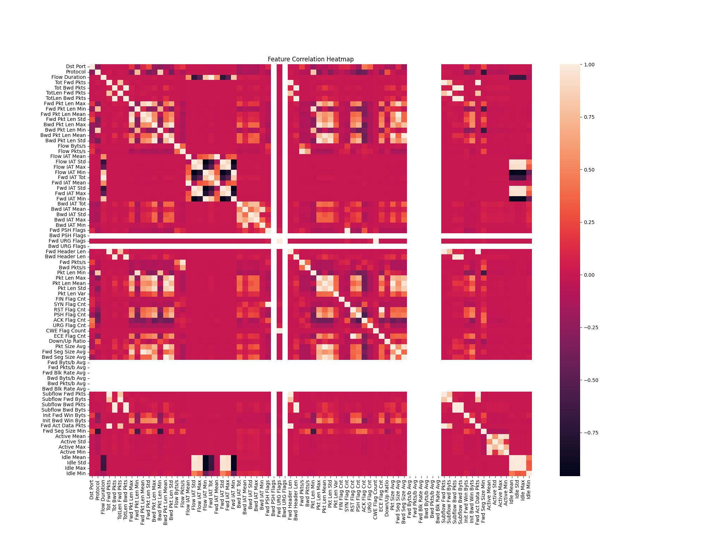

# IDS_GPT-Diffusion
将流特征文本化，经过训练后，以流特征为prompt，模型输出流的类型。
# GPT
生成的是流特征  
实时组流，提取特征，对照
# Diffusion相关的库
https://github.com/huggingface/diffusers  
https://github.com/lucidrains/denoising-diffusion-pytorch
# 数据
Header: ['Dst Port', 'Protocol', 'Timestamp', 'Flow Duration', 'Tot Fwd Pkts', 'Tot Bwd Pkts', 
'TotLen Fwd Pkts', 'TotLen Bwd Pkts', 'Fwd Pkt Len Max', 'Fwd Pkt Len Min', 'Fwd Pkt Len Mean', 
'Fwd Pkt Len Std', 'Bwd Pkt Len Max', 'Bwd Pkt Len Min', 'Bwd Pkt Len Mean', 'Bwd Pkt Len Std', 
'Flow Byts/s', 'Flow Pkts/s', 'Flow IAT Mean', 'Flow IAT Std', 'Flow IAT Max', 'Flow IAT Min', 
'Fwd IAT Tot', 'Fwd IAT Mean', 'Fwd IAT Std', 'Fwd IAT Max', 'Fwd IAT Min', 'Bwd IAT Tot', 
'Bwd IAT Mean', 'Bwd IAT Std', 'Bwd IAT Max', 'Bwd IAT Min', 'Fwd PSH Flags', 'Bwd PSH Flags', 
'Fwd URG Flags', 'Bwd URG Flags', 'Fwd Header Len', 'Bwd Header Len', 'Fwd Pkts/s', 'Bwd Pkts/s', 
'Pkt Len Min', 'Pkt Len Max', 'Pkt Len Mean', 'Pkt Len Std', 'Pkt Len Var', 'FIN Flag Cnt', 
'SYN Flag Cnt', 'RST Flag Cnt', 'PSH Flag Cnt', 'ACK Flag Cnt', 'URG Flag Cnt', 'CWE Flag Count', 
'ECE Flag Cnt', 'Down/Up Ratio', 'Pkt Size Avg', 'Fwd Seg Size Avg', 'Bwd Seg Size Avg', 
'Fwd Byts/b Avg', 'Fwd Pkts/b Avg', 'Fwd Blk Rate Avg', 'Bwd Byts/b Avg', 'Bwd Pkts/b Avg', 
'Bwd Blk Rate Avg', 'Subflow Fwd Pkts', 'Subflow Fwd Byts', 'Subflow Bwd Pkts', 'Subflow Bwd Byts', 
'Init Fwd Win Byts', 'Init Bwd Win Byts', 'Fwd Act Data Pkts', 'Fwd Seg Size Min', 'Active Mean', 
'Active Std', 'Active Max', 'Active Min', 'Idle Mean', 'Idle Std', 'Idle Max', 'Idle Min', 'Label']  
每个CSV文件中不同标签的数量和标签名称列表：  
Friday-02-03-2018_TrafficForML_CICFlowMeter.csv: 标签数量 = 2, 标签名称 = ['Benign', 'Bot']  
Friday-16-02-2018_TrafficForML_CICFlowMeter.csv: 标签数量 = 4, 标签名称 = ['Benign', 'DoS attacks-SlowHTTPTest', 'DoS attacks-Hulk', 'Label']  
Friday-23-02-2018_TrafficForML_CICFlowMeter.csv: 标签数量 = 4, 标签名称 = ['Benign', 'Brute Force -Web', 'Brute Force -XSS', 'SQL Injection']  
Thuesday-20-02-2018_TrafficForML_CICFlowMeter.csv: 标签数量 = 2, 标签名称 = ['Benign', 'DDoS attacks-LOIC-HTTP']  
Thursday-01-03-2018_TrafficForML_CICFlowMeter.csv: 标签数量 = 3, 标签名称 = ['Benign', 'Label', 'Infilteration']  
Thursday-15-02-2018_TrafficForML_CICFlowMeter.csv: 标签数量 = 3, 标签名称 = ['Benign', 'DoS attacks-GoldenEye', 'DoS attacks-Slowloris']  
Thursday-22-02-2018_TrafficForML_CICFlowMeter.csv: 标签数量 = 4, 标签名称 = ['Benign', 'Brute Force -Web', 'Brute Force -XSS', 'SQL Injection']  
Wednesday-14-02-2018_TrafficForML_CICFlowMeter.csv: 标签数量 = 3, 标签名称 = ['Benign', 'FTP-BruteForce', 'SSH-Bruteforce']  
Wednesday-21-02-2018_TrafficForML_CICFlowMeter.csv: 标签数量 = 3, 标签名称 = ['Benign', 'DDOS attack-LOIC-UDP', 'DDOS attack-HOIC']  
Wednesday-28-02-2018_TrafficForML_CICFlowMeter.csv: 标签数量 = 3, 标签名称 = ['Benign', 'Label', 'Infilteration']  
merged_data.csv: 标签数量 = 15, 标签名称 = ['Benign', 'SSH-Bruteforce', 'FTP-BruteForce', 'DoS attacks-GoldenEye', 'DoS attacks-Slowloris', 'DoS attacks-Hulk', 
'DoS attacks-SlowHTTPTest', 'DDoS attacks-LOIC-HTTP', 'DDOS attack-HOIC',
'DDOS attack-LOIC-UDP', 'Brute Force -XSS', 'SQL Injection', 'Brute Force -Web', 'Infilteration', 'Bot']  
## 数据关联度
Features: TotLen Bwd Pkts and Tot Bwd Pkts, Correlation: 0.99  
Features: Fwd Pkt Len Std and Fwd Pkt Len Max, Correlation: 0.96  
Features: Bwd Pkt Len Std and Bwd Pkt Len Max, Correlation: 0.97  
Features: Flow IAT Min and Flow IAT Std, Correlation: -0.96  
Features: Fwd IAT Tot and Flow Duration, Correlation: 1.00  
Features: Fwd IAT Mean and Flow IAT Mean, Correlation: 1.00  
Features: Fwd IAT Std and Flow IAT Std, Correlation: 1.00  
Features: Fwd IAT Std and Flow IAT Min, Correlation: -0.96  
Features: Fwd IAT Max and Flow IAT Max, Correlation: 1.00  
Features: Fwd IAT Min and Flow IAT Std, Correlation: -0.96  
Features: Fwd IAT Min and Flow IAT Min, Correlation: 1.00  
Features: Fwd IAT Min and Fwd IAT Std, Correlation: -0.96  
Features: Fwd Header Len and Tot Fwd Pkts, Correlation: 1.00  
Features: Bwd Header Len and Tot Bwd Pkts, Correlation: 1.00  
Features: Bwd Header Len and TotLen Bwd Pkts, Correlation: 1.00  
Features: Pkt Len Max and Bwd Pkt Len Max, Correlation: 0.96  
Features: Pkt Len Max and Bwd Pkt Len Std, Correlation: 0.95  
Features: Pkt Len Std and Pkt Len Max, Correlation: 0.97  
Features: SYN Flag Cnt and Fwd PSH Flags, Correlation: 1.00  
Features: CWE Flag Count and Fwd URG Flags, Correlation: 1.00  
Features: ECE Flag Cnt and RST Flag Cnt, Correlation: 1.00  
Features: Pkt Size Avg and Pkt Len Mean, Correlation: 0.99  
Features: Fwd Seg Size Avg and Fwd Pkt Len Mean, Correlation: 1.00  
Features: Bwd Seg Size Avg and Bwd Pkt Len Mean, Correlation: 1.00  
Features: Subflow Fwd Pkts and Tot Fwd Pkts, Correlation: 1.00  
Features: Subflow Fwd Pkts and Fwd Header Len, Correlation: 1.00  
Features: Subflow Fwd Byts and TotLen Fwd Pkts, Correlation: 1.00  
Features: Subflow Bwd Pkts and Tot Bwd Pkts, Correlation: 1.00  
Features: Subflow Bwd Pkts and TotLen Bwd Pkts, Correlation: 0.99  
Features: Subflow Bwd Pkts and Bwd Header Len, Correlation: 1.00  
Features: Subflow Bwd Byts and Tot Bwd Pkts, Correlation: 0.99  
Features: Subflow Bwd Byts and TotLen Bwd Pkts, Correlation: 1.00  
Features: Subflow Bwd Byts and Bwd Header Len, Correlation: 1.00  
Features: Subflow Bwd Byts and Subflow Bwd Pkts, Correlation: 0.99  
Features: Fwd Act Data Pkts and Tot Fwd Pkts, Correlation: 1.00  
Features: Fwd Act Data Pkts and Fwd Header Len, Correlation: 0.99  
Features: Fwd Act Data Pkts and Subflow Fwd Pkts, Correlation: 1.00  
Features: Idle Mean and Flow IAT Std, Correlation: 0.97  
Features: Idle Mean and Fwd IAT Std, Correlation: 0.97  
Features: Idle Std and Flow IAT Std, Correlation: 0.96  
Features: Idle Std and Fwd IAT Std, Correlation: 0.96  
Features: Idle Std and Idle Mean, Correlation: 0.98  
Features: Idle Max and Flow IAT Std, Correlation: 0.96  
Features: Idle Max and Fwd IAT Std, Correlation: 0.96  
Features: Idle Max and Idle Mean, Correlation: 0.98  
Features: Idle Max and Idle Std, Correlation: 0.99  
